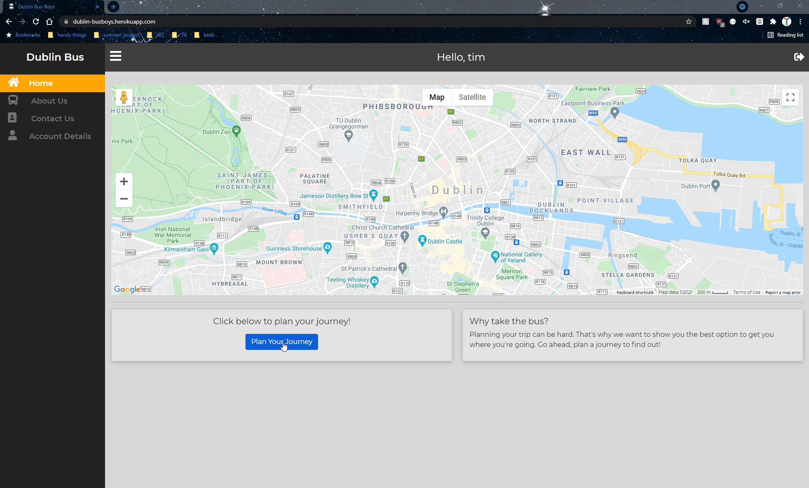
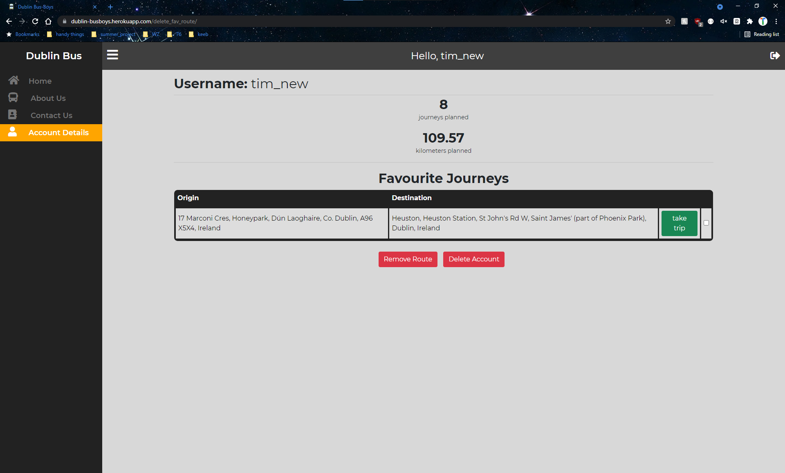

# Dublin Bus-Boys

Our app is currently hosted **[here](https://dublin-busboys.herokuapp.com/)**

### The app all Dublin commuters have been waiting for!

Predictions are modelled using Dublin Bus data from 2018, but don't worry, they're still amazing predictions.


### Have a route you're especially fond of?

Add it to your favourites!



### Want to plan one of your favourite trips?

Select it from the dropdown!


### Want to plan your favourite route but feeling too lazy to select start start and end points?

Use the take trip button!


### Have a look at how many trips you've planned on the app

Our app tracks how many trips you've planned out and how far those trips have taken you!



### System Architecture


#### Run the app for yourself locally

There are a few steps required to do this so bear with us:

1. Clone this repository
2. Create a new anaconda environment:

```bash
$ conda create --name dublin_bus_app python=3.9
```

3. Go into the folder where you cloned the repository, look for a file named "requirements.txt" and run:

```bash
$ conda activate dublin_bus_app
$ pip install -r requirements.txt
```

4. Go to the repository root on your terminal
5. Run the following command:

```bash
$ python manage.py runserver
```

6. Congratulations you should now have a local version of the app running!
